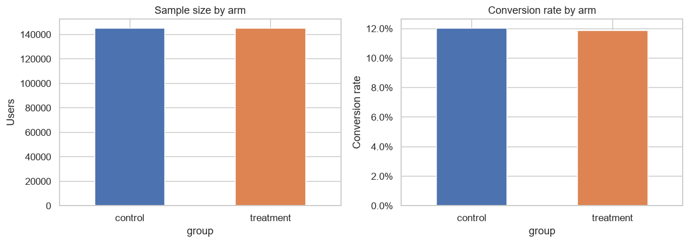

# A/B Testing & Experiment Analysis Toolkit

[](../../actions/workflows/tests.yml)

A landing-page conversion experiment, analyzed the way an experimentation team actually should — power analysis before interpretation, two independent hypothesis tests cross-checked against each other, segment-level diagnostics for Simpson's paradox and novelty effects, and regression with variance-inflation and likelihood-ratio checks instead of bare coefficients. Every statistic is implemented as tested library code, not one-off notebook math.

**[→ Read the full analysis notebook](notebooks/experiment_analysis.ipynb)**

## The finding

> **Recommendation: do not ship the new landing page.** Two independent hypothesis tests agree (p≈0.19), the experiment had 8.4x the statistical power needed to detect a 1-percentage-point lift, no segment or time-window diagnostic surfaces a confound, and the regression confirms it. This is a well-powered null result, not an inconclusive one.

| Check | Result |
|---|---|
| Sample | 145,274 control / 145,310 treatment, baseline conversion 12.04% |
| Power | MDE ≈ 0.35pp at 80% power — 8.4x the sample needed for a 1pp effect |
| Two-proportion z-test | p = 0.190, 95% CI [-0.39pp, +0.08pp] |
| Permutation test (10,000 resamples) | p = 0.191 — agrees with the z-test |
| Effect size | Cohen's h = -0.0049 (far below "small") |
| Randomization balance | χ² p = 0.41 — assignment independent of country |
| Novelty effect | none — treatment/day interaction p = 0.88 |
| Logistic regression | OR = 0.985, 95% CI [0.963, 1.007] — country terms don't improve the model (LR p = 0.20) |



## Why this isn't just another A/B testing tutorial

This project started from a well-known public dataset used in dozens of portfolio repos, most of which reproduce the same methodological errors. This version exists specifically to fix them:

| Problem in the typical version | Fix here |
|---|---|
| Null distribution built from `np.random.normal(0, p_diffs.std())` — a parametric approximation standing in for a bootstrap | A real permutation test that resamples the *observed* data directly (via an exact hypergeometric shortcut — see `hypothesis_test.permutation_test`), with a separately-computed bootstrap CI rather than reusing the null's percentiles as if they were one |
| "Fail to reject the null" reported with no power analysis | Pre-registered minimum-detectable-effect check (`power_analysis.py`) run *before* the result is interpreted, so a null result can be told apart from an underpowered one |
| Odds ratios computed inconsistently (`1/np.exp(-0.0149)` in one section, `np.exp(0.0506)` in another, for coefficients of the same sign) | One consistent, tested transformation (`regression.odds_ratio_table`), always reported with a confidence interval, never a lone point estimate |
| Interaction terms added to a regression and interpreted coefficient-by-coefficient | Variance inflation factors computed first (`regression.vif_table`) — this project's own interaction terms show VIF > 10, which is disclosed and the coefficients are *not* over-interpreted as a result |
| `timestamp` column present in the data, unused | Formal novelty/primacy-effect check: treatment-effect-over-time interaction test (`segmentation.novelty_effect_check` + a time-trend logistic model) |
| Country segments compared with a bar chart, no significance check | Chi-square randomization-balance check, a directional Simpson's-paradox flag, *and* a per-segment significance test — so a directional flag is never reported as if it were a significant reversal (this project's own UK segment trips the directional flag but fails the significance test, and both facts are shown) |
| Dataset presented without provenance | [`data/DATA_CARD.md`](data/DATA_CARD.md) documents what is and isn't verifiable about the data's origin, including structural evidence it's synthetic |

## Repository structure

```
├── src/ab_testing/          statistically-reviewed, unit-tested library code
│   ├── data_prep.py         load, validate, clean — every drop counted and reported
│   ├── power_analysis.py    sample size / minimum detectable effect (statsmodels)
│   ├── hypothesis_test.py   two-proportion z-test, permutation test, bootstrap CI
│   ├── segmentation.py      Simpson's paradox check, randomization balance, novelty effect
│   └── regression.py        logistic regression, odds ratios + CIs, VIF, likelihood-ratio test
├── tests/                    30 pytest unit tests validating the statistics against known cases
├── notebooks/
│   └── experiment_analysis.ipynb   the full narrative analysis, pre-executed with real output
├── scripts/
│   ├── run_experiment.py    CLI: run the pipeline on any two-arm CSV → JSON results
│   └── generate_report.py   CLI: JSON results → business-readable markdown report + recommendation
├── data/
│   ├── raw/                 ab_data.csv, countries.csv
│   └── DATA_CARD.md         data provenance, schema, and honest limitations
├── reports/                  generated report + figures (regenerable, not hand-edited)
├── .claude/skills/           Claude Code skills that automate the pipeline (see below)
└── .github/workflows/        CI: pytest runs on every push
```

## Reproduce it

```bash
python -m venv .venv
./.venv/Scripts/pip install -e ".[dev]"          # Windows; use bin/pip on macOS/Linux

pytest tests/ -v                                  # 30 tests, validates the stats

python -m ipykernel install --user --name ab-testing-exec --display-name "Python (ab-testing)"
jupyter notebook notebooks/experiment_analysis.ipynb

# or, run the same pipeline headlessly:
python scripts/run_experiment.py --ab-data data/raw/ab_data.csv --countries data/raw/countries.csv --mde 0.01 --out reports/experiment_results.json
python scripts/generate_report.py --results reports/experiment_results.json --out reports/experiment_report.md
```

## Claude Code skills

Two [Claude Code Skills](https://docs.claude.com/en/docs/claude-code) package the pipeline as reusable, agent-invokable automation rather than one-off scripts someone has to remember exists:

- **`run-ab-experiment`** — runs the full statistical pipeline on any two-arm conversion CSV (this project's data, or a new one) and produces a structured JSON results file.
- **`generate-experiment-report`** — turns that JSON into a business-readable markdown report with a rule-based ship / don't-ship / run-longer recommendation, so the recommendation logic lives in one auditable place (`scripts/generate_report.py::recommend()`) instead of being freshly reasoned about — and potentially reasoned about inconsistently — every time.

Point Claude Code at this repo and ask it to "run the experiment analysis" or "check if this new dataset is well-powered" — it will find and use these.

## Data & limitations

The dataset is a well-known public pedagogical set (Udacity's "Analyze A/B Test Results" project), not verified real production data — see [`data/DATA_CARD.md`](data/DATA_CARD.md) for the full writeup, including the structural evidence it's synthetic (a dead-even 147,239/147,239 landing-page split, an exact 23-day window). This project treats the **methodology** as the deliverable — every statistical function is validated in `tests/` against known textbook results and constructed edge cases (e.g. a hand-built Simpson's paradox, a hand-built collinear predictor set) — not the specific numeric conclusion as a claim about a real company. Full limitations, including the absence of guardrail metrics and sequential-testing corrections, are in the notebook's final section.

## Stack

Python · pandas · NumPy · SciPy · statsmodels · matplotlib/seaborn · pytest · Jupyter — see `pyproject.toml` for pinned minimums.

## License

[MIT](LICENSE)
